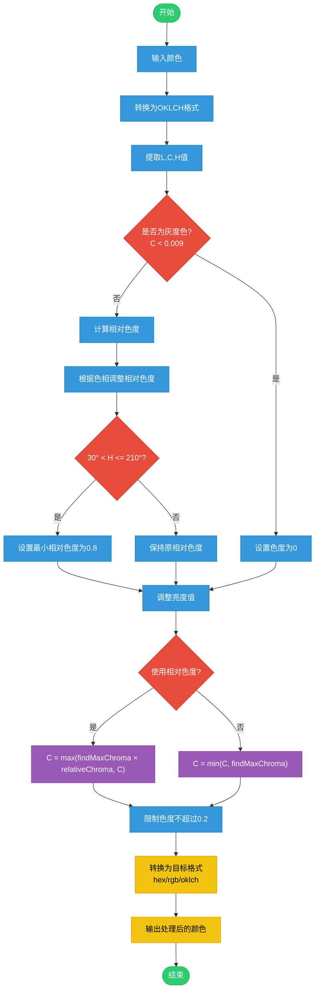

# Color Processor 颜色处理流程

## 处理步骤说明

### 1. 颜色输入与转换

- 接受多种格式的颜色输入
- 统一转换为 OKLCH 色彩空间处理

### 2. 灰度检测

- 当色度 C < 0.009 时判定为灰度色
- 灰度色维持零色度处理

### 3. 相对色度处理

- 计算基础相对色度值
- 特殊色相区间(30°-210°)强制最小相对色度 0.8

### 4. 亮度调整

- 使用公式：L = min(2L - 1.3, 0.5)
- 压缩高亮度范围

### 5. 色度计算与限制

- 根据相对色度模式选择计算方式
- 使用二分法确定最大色度
- 限制最终色度不超过 0.2

### 6. 输出转换

- 支持转换为 hex/rgb/oklch 格式
- 保证输出格式的精确性

## 注意事项

1. 所有计算在 OKLCH 色彩空间进行
2. 考虑 sRGB 显示器色域限制
3. 包含完整的错误处理机制
4. 保证色彩还原的准确性
